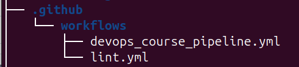
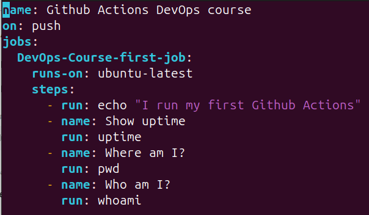
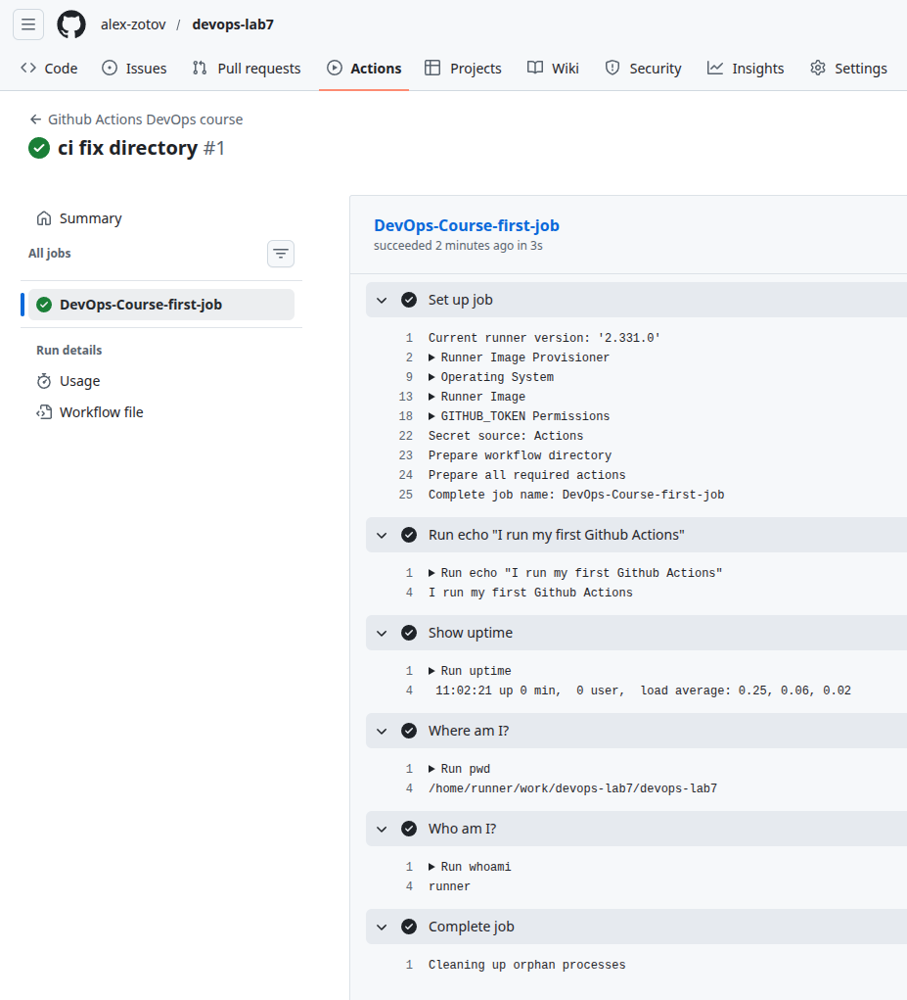
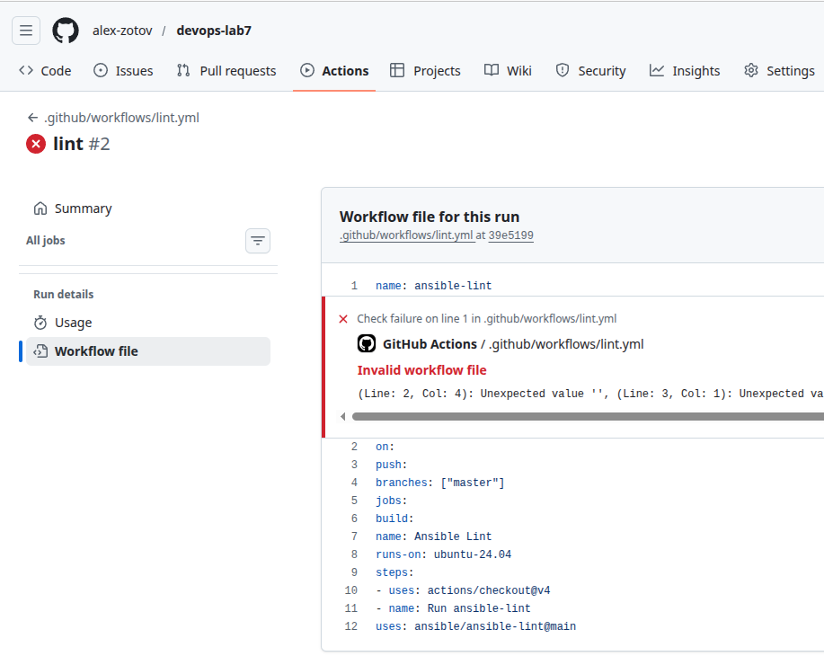
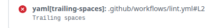
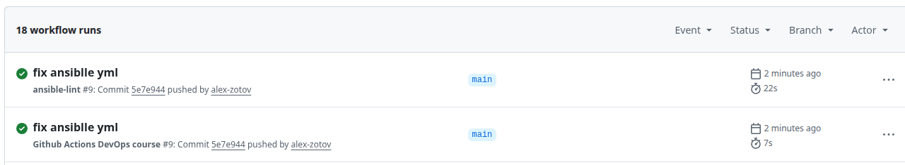

## Л07-2. Введение в CI = Continuous Integration

### Github Actions
.github/workflows

**Workflow** (pipeline) – файл с описанием jobs
Event – событие, по которому будет стартовать workflow  
**Jobs** – группы шагов, по умолчанию они независимы и выполняются параллельно. Можно
прописать зависмость и последовательность выполнения   
Jobs. Каждая job выполняется на
своём отдельном runner.  
**Steps** – последовательность шагов внутри jobs. Выполняется на одном runner.  
**Actions** – способ компоновки популярных jobs в единый блок для повторного использования и
публикации

Скопировал все файлы из лабы Л07-1 (devops-lab6)

### Добавить функции CI

Активируем CI-пайплайны (сценарии) – Github Actions. Settings / Code and automation / Action / General  
Allow all actions and reusable workflows

Добавляем CI-пайплайны (сценарии)


#### Тестовый сценарий  
(devops_course_pipeline.yml)


Добавляем сценарий в git
```
git add .github/
git commit -m 'ci first test'
git push
```

Идём в github


#### Боевой сценарий – линтер 

.github/workflows/lint.yml
```
git add .github/workflows/lint.yml 
git commit -m 'lint'
git push
```

получили ошибки


#L2 - это line 2, как оказалось


поправил .github/workflows/lint.yml
```
git add .github/workflows/lint.yml 
git commit -m 'fix lint.yml'
git push
```

Отправил в гит все файлы ansible

**Use FQCN for builtin module actions (apt)**  
FQCN - это Fully Qualified Collection Name  
вместо apt  
рекомендуют ипользовать <коллекция>.<подраздел>.<модуль>.  
Для встроенных модулей Ansible это обычно ansible.builtin.<модуль>.

**Package installs should not use latest**  
если указываем **state: latest**, то риск невоспроизводимости  
лучше указать конкретную версию nginx или **state: present**  
state: present - будет установлена последняя версия и в дальнейшем не будет обновлятся.

В итоге получил заветные зелёные галочки
